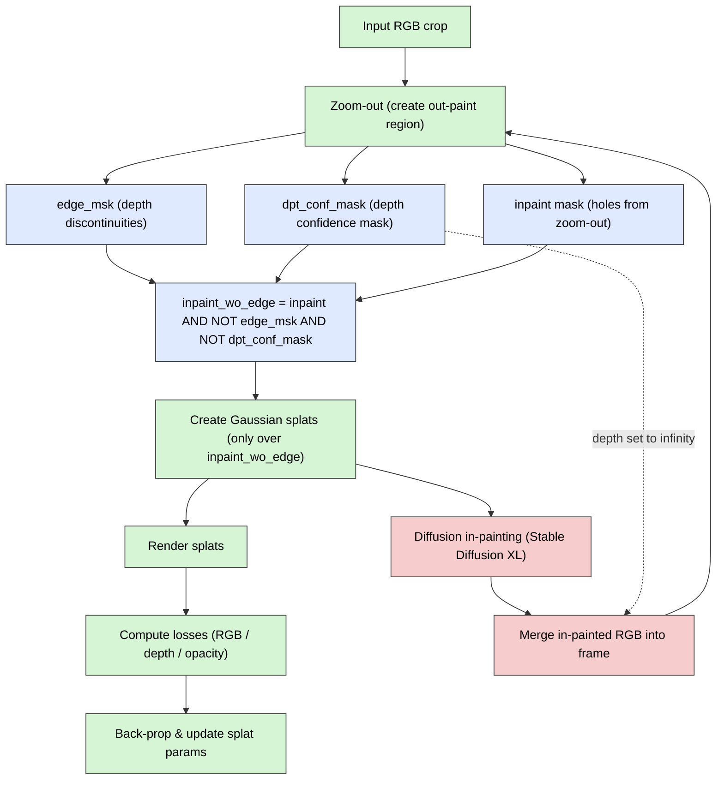

```mermaid
flowchart TD
    classDef supervised fill:#d5f5d5,stroke:#333,color:#000
    classDef unsupervised fill:#f7cccc,stroke:#333,color:#000
    classDef mask fill:#dfe9ff,stroke:#333,color:#000
    
    A["Input RGB crop"]:::supervised --> B["Zoom-out (create out-paint region)"]:::supervised
    
    B --> D["edge_msk (depth discontinuities)"]:::mask
    B --> E["dpt_conf_mask (depth confidence mask)"]:::mask
    B --> F["inpaint mask (holes from zoom-out)"]:::mask
    
    D --> G["inpaint_wo_edge = inpaint AND NOT edge_msk AND NOT dpt_conf_mask"]:::mask
    E --> G
    F --> G
    
    G --> H["Create Gaussian splats (only over inpaint_wo_edge)"]:::supervised
    H --> I["Render splats"]:::supervised
    I --> J["Compute losses (RGB / depth / opacity)"]:::supervised
    J --> K["Back-prop & update splat params"]:::supervised
    
    H --> L["Diffusion in-painting (Stable Diffusion XL)"]:::unsupervised
    L --> M["Merge in-painted RGB into frame"]:::unsupervised
    M --> B
    
    E -.->|depth set to infinity| M
```