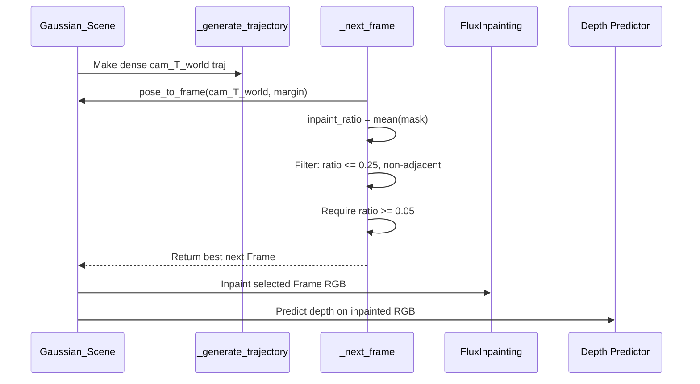
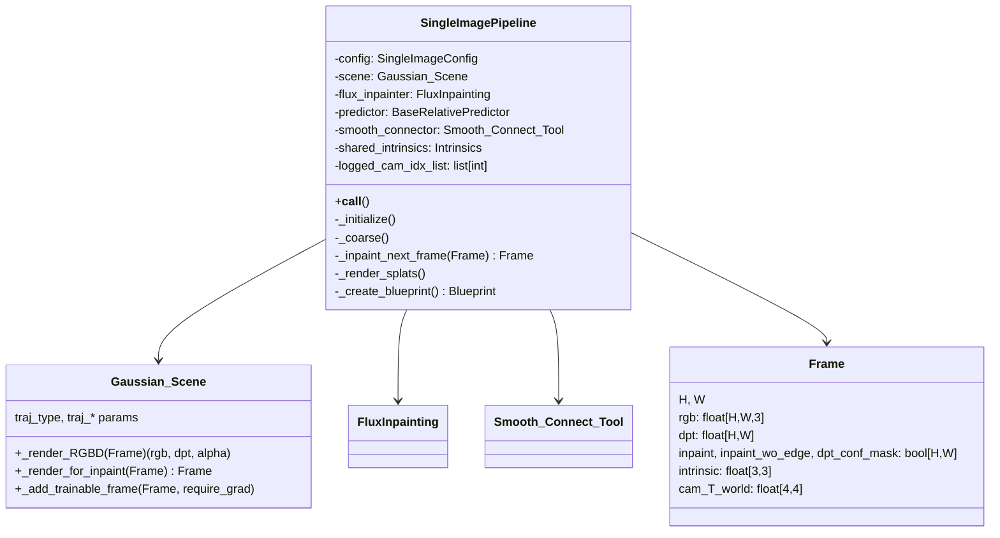

# VistaDream Single Image Pipeline

This document explains the `single_img_pipeline` in `src/vistadream/api/single_img_pipeline.py`: what it does, how the data flows, and the roles of the main components it orchestrates.

## Overview
- Purpose: Turn a single input image into an expanded scene by outpainting, estimating depth, building a Gaussian Splat representation, and rendering a short camera trajectory.
- Core stages:
  - Outpainting via Flux to expand the input
  - Single-pass depth estimation on the outpainted image (reused for the input crop)
  - Initialize and iteratively grow a Gaussian scene with trainable splats
  - Render intermediate and final results, while logging to Rerun

## Key Components
- `SingleImagePipeline`: Orchestration class coordinating the whole flow.
- `FluxInpainting`: Wrapper around Flux-Dev-Fill model for image inpainting.
- `RelativeDepthPrediction` + `MogeV1Predictor`: Predicts relative depth and intrinsic `K_33` from RGB.
- `Gaussian_Scene` and `Frame`: Scene data structure and per-view buffers for RGB/depth/masks/intrinsics/extrinsics.
- `Smooth_Connect_Tool`: Aligns predicted depth to rendered depth and smooths boundaries.
- `GS_Train_Tool`: Optimizer over Gaussian splats for newly added frames.
- `rerun` logging + blueprint: Visualize RGB/depth/masks, camera frusta, and the evolving scene.

## Data Contracts (Shapes/Dtypes)
- `rgb_hw3`: `UInt8[np.ndarray, "H W 3"]` in [0,255] for Flux and logging; frames store `float32` in [0,1].
- `dpt`: `Float[np.ndarray, "H W"]` real depth (meters).
- `inpaint`: `Bool[np.ndarray, "H W"]` supervision mask for training; `True` = supervise.
- `inpaint_wo_edge`: `Bool[np.ndarray, "H W"]` refined mask excluding depth edges and low-confidence areas.
- `dpt_conf_mask`: `Bool[np.ndarray, "H W"]` where depth is confident.
- `intrinsic`: `Float[np.ndarray, "3 3"]` pinhole intrinsics.
- `cam_T_world`: `Float[np.ndarray, "4 4"]` camera-to-world transform.

## High-Level Flow

```mermaid
flowchart TD
    A[Input image] --> B[process_image to max res]
    B --> C[add_border_and_mask
            expansion_percent → border]
    C --> D[FluxInpainting(outpaint_img, mask)
            → outpainted RGB]
    D --> E[Relative depth predictor
            → depth + K_33 + confidence]
    E --> F[Build outpaint Frame
            (rgb, dpt, masks, intr/extr)]
    E --> G[Build input Frame using
            outpaint dpt in original ROI
            (inpaint = all True)]
    F --> H[Log frames to Rerun]
    G --> H
    H --> I[Initialize Gaussian_Scene
            and train 100 iters]
    I --> J{run_coarse?}
    J -- yes --> K[Generate dense camera
                    trajectory]
    K --> L[Select poses with large but
             bounded inpaint area]
    L --> M[Render-for-inpaint → Frame,
             Flux inpaint, predict depth,
             align depth, refine masks]
    M --> N[Add frame, train 500 iters,
             log, repeat]
    J -- no --> O[Skip coarse]
    N --> P[Final render trajectory,
             log final point cloud + video]
    O --> P
```

## Initialization Details (`_initialize`)
- Resize input via `process_image` to fit `max_resolution` while respecting 32-multiple constraints.
- Compute outpainting canvas and binary mask with `add_border_and_mask`, using `expansion_percent` distributed per side.
- Run `FluxInpainting` once to fill the border; convert output to `rgb_hw3`.
- Run a single relative depth pass on the outpainted RGB to obtain:
  - `depth`: `H×W` float, NaN/Inf sanitized to 0
  - `confidence`: scalar per pixel → thresholded into `dpt_conf_mask`
  - `K_33`: used to build intrinsics for both frames
- Build outpaint `Frame`:
  - `inpaint` = the border mask; `inpaint_wo_edge` = mask ∧ ¬`depth_edges_mask(depth)` ∧ `dpt_conf_mask`
  - `intrinsic` and `PinholeParameters` from predictor `K_33` and image size
  - Extrinsics = identity (world origin)
- Build input `Frame` reusing the same depth pass:
  - Take the original image ROI from the outpainted depth and masks
  - Adjust `K_33` principal point to the input center
  - `inpaint` = all `True` to supervise all original pixels during training
  - `inpaint_wo_edge` = ¬edges ∧ `dpt_conf_mask` (restricted to ROI)
- Log both frames to Rerun and bootstrap the `Gaussian_Scene` by adding the two frames and running `GS_Train_Tool` for 100 iterations.

Note on training logic: `inpaint=True` means “supervise this pixel.” For the input view we set all pixels to `True` to force perfect reproduction of original content. For the outpaint view, we supervise only the new regions.

## Coarse Expansion (`_coarse`)
- Generate a dense trajectory: `_generate_trajectory(scene, nframes = n_frames*10)` using `scene.traj_type` (default spiral).
- Score each candidate pose by rendering with `scene._render_for_inpaint(frame)` and measuring the fraction of `inpaint=True`.
- Selection policy:
  - Discard frames with inpaint area > 25%
  - Enforce non-adjacency to avoid near-duplicates
  - Require minimum inpaint area ≥ 5%
  - Pick the best remaining frame and append its index to `logged_cam_idx_list` for UI
- For each selected pose:
  - Create a `Frame` via `pose_to_frame` (optionally expanded by `margin`)
  - Run `FluxInpainting` on its `inpaint` area
  - Predict depth for the inpainted RGB
  - Align predicted depth to the frame’s original rendered depth using `Smooth_Connect_Tool._affine_dpt_to_GS` (coarse scale/shift + smooth refinement) and recompute masks:
    - `inpaint_wo_edge` = `inpaint` ∧ ¬`depth_edges_mask(aligned_dpt)` ∧ `dpt_conf_mask`
  - Log to Rerun, add to `Gaussian_Scene`, and run `GS_Train_Tool` for 500 iterations
  - Update the blueprint tab to “Coarse Scene”

### Frame Selection Logic


## Final Rendering (`_render_splats`)
- Build a final trajectory of up to 150 frames (scaled to `len(scene.frames)*25`).
- Log all splats as a single `Points3D` entity (positions from concatenated `gf.xyz`, colors from `sigmoid(gf.rgb)`).
- For each camera on the trajectory:
  - Render `RGB+Depth` with `scene._render_RGBD`
  - Log RGB and Depth along with the camera pinhole parameters (`Intrinsics`/`Extrinsics`)

## Rerun Blueprint (UI)
- Tabs: Initialization, Coarse Scene, Final Scene.
- 2D panels per camera: RGB / Depth / Confidence / Inpaint masks.
- 3D view excludes depth/mask tensors to keep the world view clean, shows camera frusta and point clouds.
- Orientation-aware layout: adjusts column shares for portrait vs. landscape input.

## Important Implementation Notes
- Depth reuse: Only one depth pass is computed (on the outpainted image). The input’s depth and masks are cropped from that result, saving compute and ensuring consistent scaling.
- Intrinsics handling: Predictor `K_33` is reused but principal point is recentered for the cropped input frame.
- Mask semantics: `inpaint=True` means “supervise” in training, not “needs synthetic content now.” This is why the input frame sets it to all `True`.
- Depth alignment: `Smooth_Connect_Tool` first finds a scale/shift to match rendered depth, then smooths differences at the inpaint boundary by iterative blurring, preventing seams.
- Image shape constraints: The pipeline relies on `process_image` to ensure sizes compatible with model/grid constraints (multiples-of-32 rule).

## Entrypoints and Usage
- Pipeline module: `src/vistadream/api/single_img_pipeline.py`
- CLI: `tools/run_vistadream.py` (full pipeline) or `tools/run_single_img.py` (if present)
- Quick run example:
  - `pixi run example`
  - Or: `pixi run python tools/run_vistadream.py --image-path  --n-frames 10 --expansion-percent 0.2`



---
If you want, I can add a minimal CLI doc snippet linking the config flags to the stages above, or extend this with a troubleshooting section (common pitfalls and expected visuals per tab).
